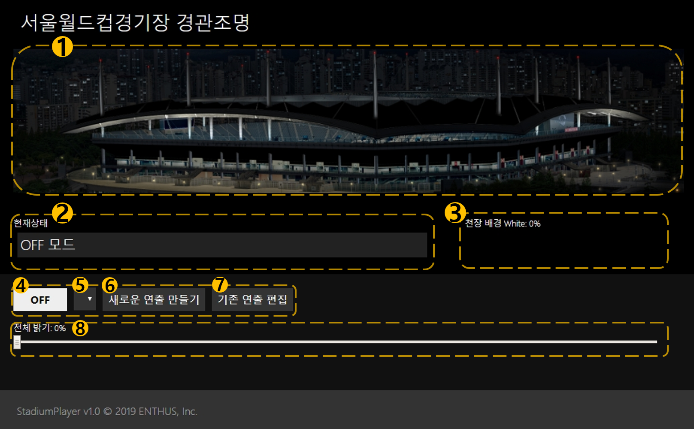
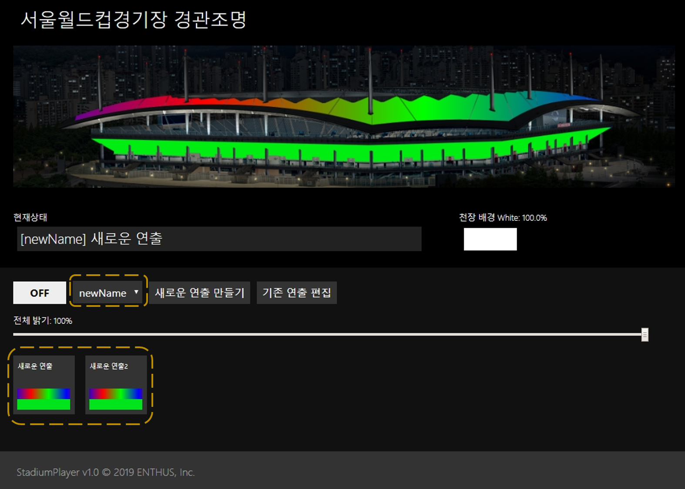

서울 월드컵 경기장  
경관조명 제어 프로그램
==========
메인화면 
----------
 
### 메인화면 상태 표시  
　메인 화면 상태 구성은 `1. 경기장 이미지` `2. 현재 상태` `3. 천장 배경 White`으로 나누어져 있어 현재 경관 조명 시스템의 동작 상태를 표시합니다.
 
`1. 경기장 이미지` : 연출 시나리오가 적용했을 때의 가상 이미지가 나타납니다. 
`2. 현재 상태` : 연출 시나리오의 이름 및 동작 상태를 표시합니다. 
`3. 천장 배경 White` : 연출 시나리오에 설정된 천장 배경 White 색상의 밝기를 표시합니다. 

### 메인화면 설정
　메인 화면의 설정은 `4. OFF` `5. 그룹 선택` `6. 새로운 연출 만들기` `7. 기존 연출 편집` 으로 구성되어 연출을 불러오거나 제작할 수 있습니다.  
`4. OFF` : `1. 경기장 이미지` 실행되고 있는 연출을 종료합니다. 

`5. 그룹 선택` : 연출 시나리오들을 그룹으로 나누어 선택합니다. 
　　　　　　　기본, 서울 FC, 국가대표팀 등 연관된 연출 시나리오들을 그룹으로 묶어 선택할 수 있습니다. 
 
`6. 새로운 연출 만들기` : 새로운 연출 시나리오를 제작합니다. 
`7. 기존 연출 편집` : 기존 연출 시나리오들을 편집합니다. 
