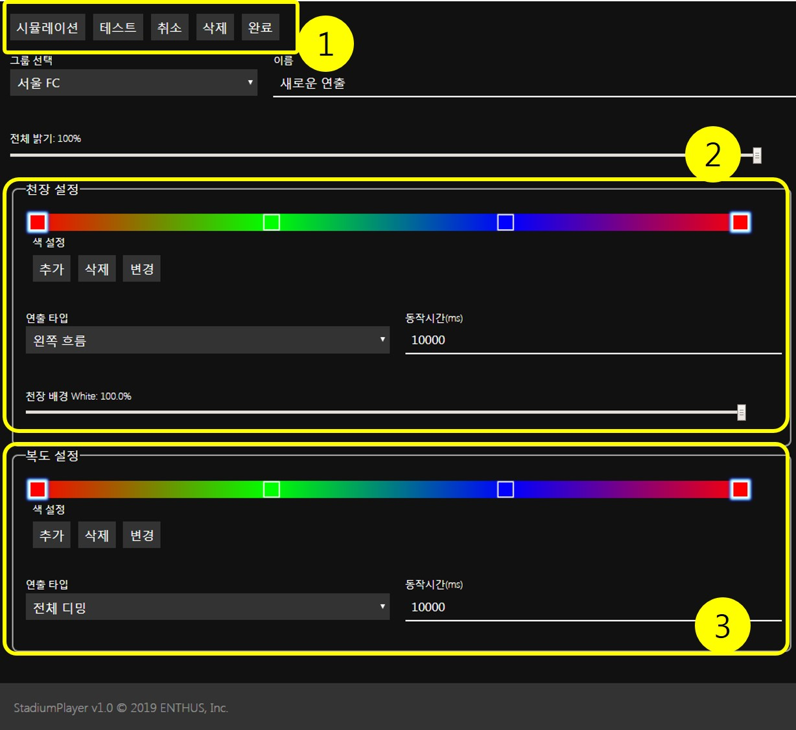

# 편집 화면

### 1. 메인 버튼
##### 시뮬레이션
편집한 연출 시나리오를 상태표시 창의 경기장 이미지에서 미리 가상으로 표시합니다.

##### 실시간 테스트
편집한 연출 시나리오를 경관 조명 시스템에 실제로 적용 테스트 합니다.

##### 취소
연출 시나리오 편집을 취소합니다.

##### 삭제
현재 연출을 삭제합니다.

##### 완료
연출 시나리오 편집을 새로 생성 또는 수정완료 합니다.

### 2. 천장 조명 설정
천장 조명은 RGBW(Red, Green, Blue, White) 의 4 색 LED 투광등으로 구성되어 있기 때문에,
별도의 White 설정 슬라이드(**2-1**)를 사용합니다.
나머지 RGB 색상은 내부의 색상 모음란을 이용합니다.
색상 모음 설정은 [색상 모음 설정 문서](editor/color.md)를 참조하십시요.

### 3. 복도 조명 설정
복도 조명은 RGB(Red, Green, Blue) 의 3 색 라인조명으로 구성되어 있기 때문에,
배경 White 설정을 제외하고는 천장 조명 설정과 모든 기능이 동일합니다.
