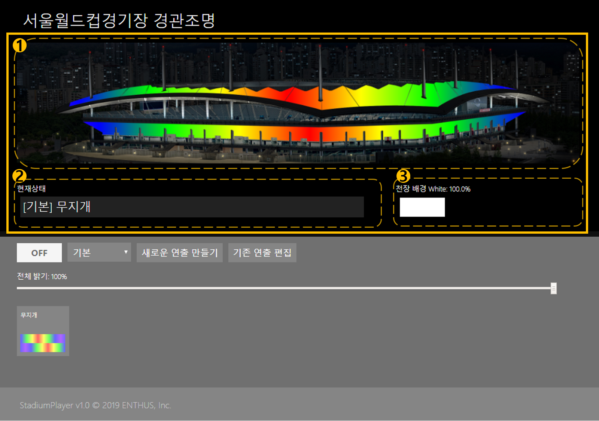
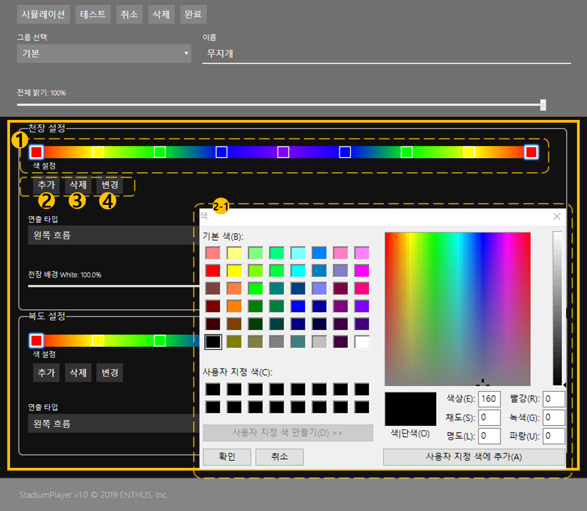
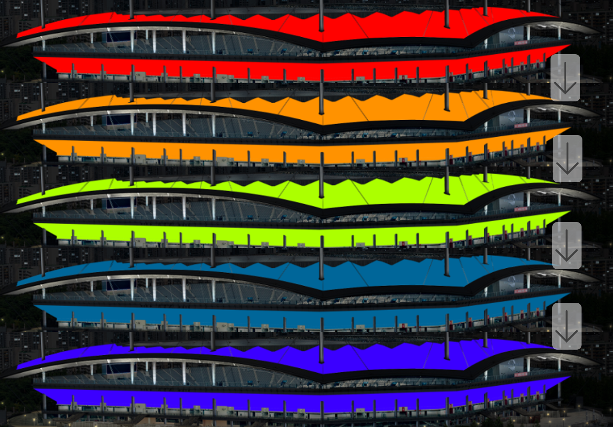
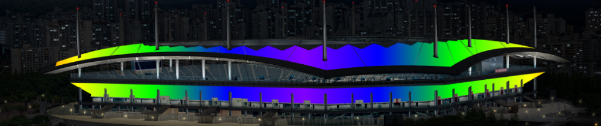

서울 월드컵 경기장  
경관조명 제어 프로그램
==========
메인화면 
----------
### 메인화면 상태 표시
 
　메인 화면 상태 구성은 `1. 경기장 이미지` `2. 현재 상태` `3. 천장 배경 White`으로 나누어져 있어 현재 경관 조명 시스템의 동작 상태를 표시합니다.

`1. 경기장 이미지` : 연출 시나리오가 적용했을 때의 가상 이미지가 나타납니다. 
`2. 현재 상태` : 연출 시나리오의 이름 및 동작 상태를 표시합니다. 
`3. 천장 배경 White` : 연출 시나리오에 설정된 천장 배경 White 색상의 밝기를 표시합니다. 

### 메인화면 설정

　메인 화면의 설정은 `1. OFF` `2. 그룹 선택` `3. 새로운 연출 만들기` `4. 기존 연출 편집` `5. 전체 밝기` `6.그룹 목록` 으로 구성되어 연출을 불러오거나 제작할 수 있습니다.  

`1. OFF` : 경기장 이미지에 실행되고 있는 연출을 종료합니다. 
`2. 그룹 선택` : 연출 시나리오들을 그룹으로 나누어 선택합니다. 
　　　　　　　기본, 서울 FC, 국가대표팀 등 연관된 연출 시나리오들을 그룹으로 묶어 선택할 수 있습니다. 

`3. 새로운 연출 만들기` : 새로운 연출 시나리오를 제작합니다. 
`4. 기존 연출 편집` : 기존 연출 시나리오들을 편집합니다. 
`5. 전체 밝기` : 경기장 이미지에 실행되고 있는 연출의 전체 밝기를 조절합니다. 
`6. 그룹 목록` : 그룹에 있는 연출 목록을 표시합니다. 

연출 편집하기
==========
새로운 연출 만들기 1
----------

`1. 그룹 선택` : 새로운 그룹을 만들거나 연출 시나리오가 묶일 그룹을 선택합니다. 
`1-2. 새로운 그룹명 입력` : 새로 만들 그룹 이름을 작성합니다. 
`2. 그룹 이름` : 연출 시나리오의 이름을 선택합니다. 

새로운 연출 만들기 2
----------
### 설정 1

`1. 선택` : 설정된 색상 모음을 표시하고, 변경 및 삭제할 색상을 선택합니다. 
`2. 추가` : 색상 모음에 새로운 색상을 추가합니다. 
`2-1. 색상 선택` : 색상 모음에 새로운 색상을 추가합니다. 
`3. 삭제` : 선택된 색상을 색상 모음에서 삭제합니다. 
`4. 변경` : 선택된 색상을 변경합니다. 

### 설정 2

`1. 전체 밝기` : 연출 시나리오의 전체 밝기를 선택합니다. 

`2. 연출 타입` : 왼쪽 흐름, 오른쪽 흐름, 전체 디밍, 정지 상태의 연출 타입을 선택합니다. 

`2-1 왼쪽 흐름`

`2-2 오른쪽 흐름`

`2-3 전체 디밍`

`2-4 정지 상태`

`2. 동작 시간` : 연출 시나리오의 동작 시간(ms)을 설정합니다. 

`3. 천장 배경 White` : RGBW 조명의 White 요소의 밝기를 설정합니다. 
`4. 복도 배경 White` : 복도 연출에는 RGB 조명이기 때문에 White 요소 설정이 없습니다. 

새로운 연출 만들기 3
----------

`1. 시뮬레이션` : 편집한 연출 시나리오를 상태표시 창의 경기장 이미지에서 미리 가상으로 표시합니다. 
`2. 실시간 테스트` : 편집한 연출 시나리오를 경관 조명 시스템에 실제로 적용 테스트 합니다. 
`3. 취소` : 연출 시나리오 편집을 취소합니다. 
`4. 삭제` : 현재 연출을 삭제합니다. 
`5. 완료` : 연출 시나리오 편집을 새로 생성 또는 수정완료 합니다. 
