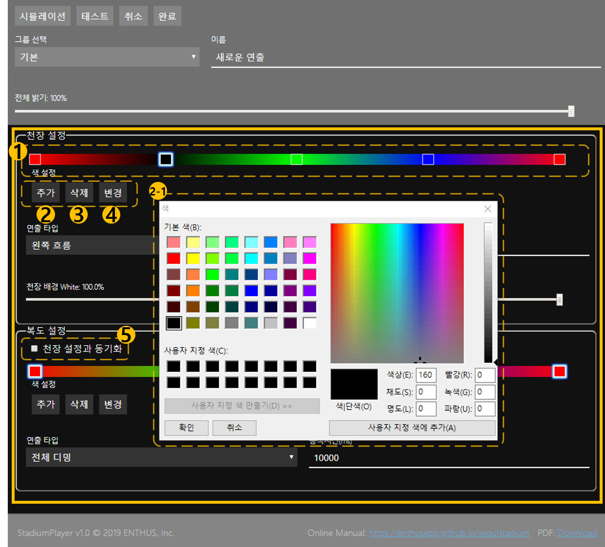

# 색상 설정
연출에 사용할 색상을 설정합니다.
색상은 1 개 이상의 색상 모음으로 구성됩니다.

## 1. 색상 모음표
설정된 색상들을 모아서 표시하고, 변경 및 삭제할 색상을 선택합니다.
선택 후 **4. 변경** 버튼을 누르면 선택된 순서의 색상을 다시 설정할 수 있습니다.
연출의 연속적인 변화를 위해 첫번째 색상과 마지막 색상은 항상 동일하게 설정됩니다.

## 2. 추가
색상 모음에 새로운 색상을 추가합니다.
클릭하면 **2-1. 색상 선택** 팝업창이 나타납니다.
   
## 3. 삭제
선택된 색상을 색상 모음에서 삭제합니다.

## 4. 변경
클릭하면 **2-1. 색상 선택** 팝업창이 나타나면서 선택된 색상을 변경할 수 있습니다.

## 5. 천장 설정과 동기화
체크 시 천장 설정과 동기화 합니다.
