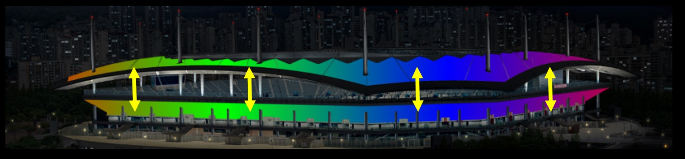
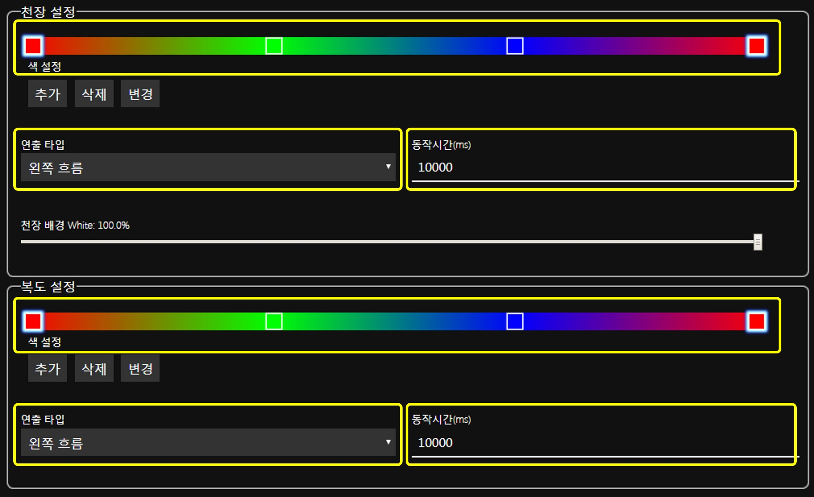

# 천장, 복도 조명 연출 동기화
**색상 모음**, **연출 타입**, **동작 시간** 을 동일하게 설정하면 천장, 복도 조명이 **동기 연출 재생**됩니다.

##### 동기 연출 재생
**동기 연출 재생**은 같은 세로 위치에 있는 천장, 복도 조명이 연출 재생 도중 항상 동일한 색상을 표시하는 것을 의미합니다.

##### 설정 예시
**동기 연출 재생**을 위해 아래 그림에서와 같이 천장, 복도 조명 색션의 **색상 모음**, **연출 타입**, **동작 시간** 을 동일하게 설정합니다.

##### 비동기 설정
반대로 천장 조명과 복도 조명이 다른 형태로 연출하고 싶을 때는 **색상 모음**, **연출 타입**, **동작 시간** 중 하나의 값이라도 다르게 설정하면 됩니다.
