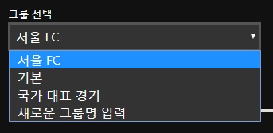

# 그룹, 이름, 밝기 설정

### 1. 그룹 선택
새로운 그룹을 만들거나 연출 시나리오가 묶일 그룹을 선택합니다.
클릭하면 아래와 같이 기존에 설정되 있는 그룹이 나타납니다.

##### 1-2. 새로운 그룹 추가 
새로운 그룹을 추가하려면 그룹 리스트에서 `새로운 그룹명 입력` 을 클릭해서 나타나는 팝업에 그룹 이름을 입력하면 됩니다.

### 2. 이름 입력
연출 시나리오의 이름을 입력합니다.

### 3. 밝기 설정
연출의 전체 밝기를 설정합니다.
[메인 화면의 밝기 설정](../main/control/basic.md#2-%EC%A0%84%EC%B2%B4-%EB%B0%9D%EA%B8%B0-%EC%A0%9C%EC%96%B4) 과 동일한 기능입니다.
메인 화면에서 연출을 선택하면 편집화면에서 미리 설정된 전체 밝기로 재생이 됩니다.

