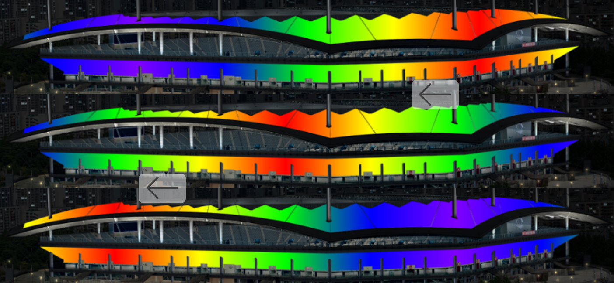
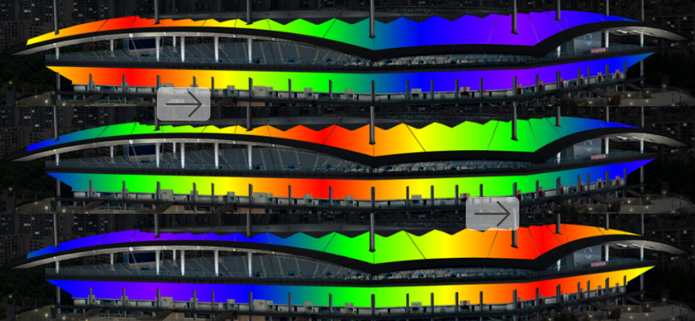
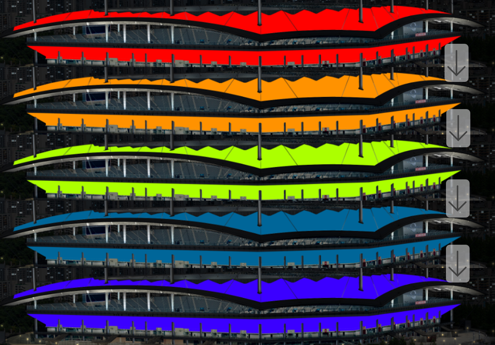
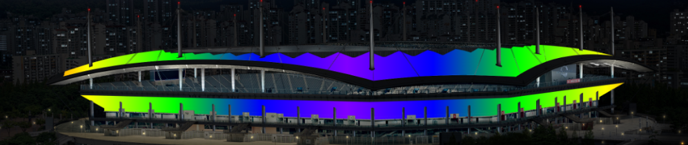

# 연출 타입
왼쪽 흐름, 오른쪽 흐름, 전체 디밍, 정지 상태의 연출 타입이 있습니다.
모든 연출에는 Gradient 효과가 포함되어 점진적으로 색상이 변경됩니다.

## 왼쪽 흐름
색상이 왼쪽으로 흐르는 연출입니다.

## 오른쪽 흐름
색상이 오른쪽으로 흐르는 연출입니다.

## 전체 디밍
색상 전체가 동일하게 변하는 연출입니다.

## 정지 상태
색상이 변하지 않고 정지된 상태로 유지되는 연출입니다.

