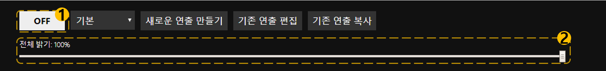

# 기본 제어

## 1. 전체 동작 OFF
경기장 이미지에 실행되고 있는 연출을 종료합니다.
상태 표시 영역의 현재 상태란에 **OFF 모드** 로 표시되고, 연출 시뮬레이션도 검은색으로 표시됩니다.

## 2. 전체 밝기 제어
경기장 이미지에 실행되고 있는 연출의 전체 밝기를 조절합니다.
슬라이드를 움직이면 아래 그림과 같이 연출의 밝기가 변하는 것을 확인할 수 있습니다.

