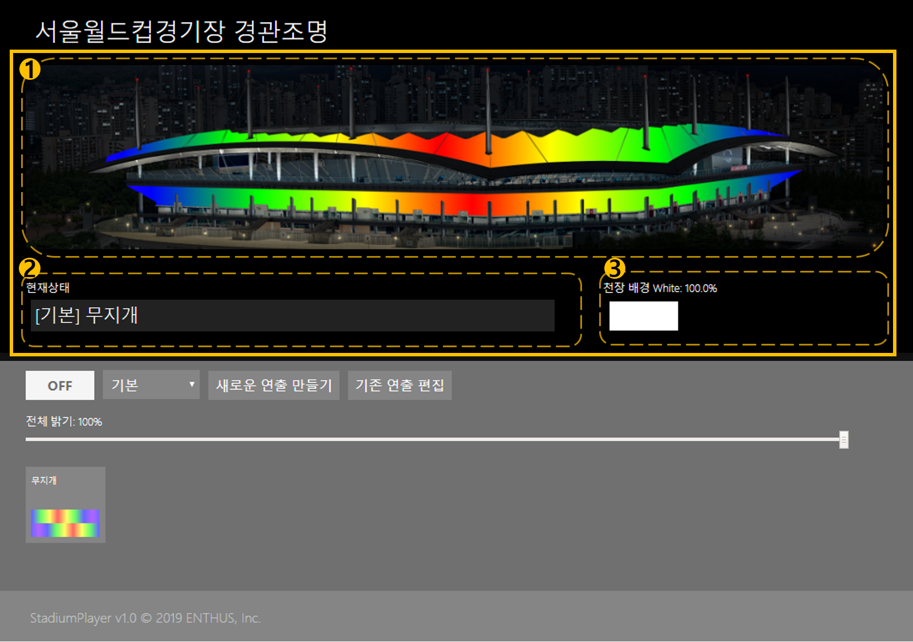

# 상태 표시
현재 경관 조명 제어 시스템의 동작 상태를 표시합니다.

## 1. 연출 시뮬레이션
선택된 연출의 시뮬레이션 동작을 나타냅니다.
흐르는 연출, 전체 변화 연출, 정지색 연출 등 실제 연출되는 모습과 유사하게 그림으로 표출됩니다.
시뮬레이션 동작이기 때문에 실제 연출과 100 % 동일하지는 않습니다.

## 2. 현재 상태
현재 선택한 연출의 이름을 표시합니다.
`[그룹명] 연출명` 의 형식으로 출력되며 자세한 동작은 연출 편집 및 연출 선택 문서에 다시 설명되어 있습니다.

## 3. 천장 배경 White
천장등은 RGBW(Red, Green, Blue, White) 의 4 색 투광 LED 등으로 구성되어 있습니다.
연출 시뮬레이션 그림에는 White 색상을 표시가 불가능하기 때문에 별도의 White 값을 표시합니다.
0 ~ 100 % 의 수치와 함께 밝기의 양이 상자형태로 표출됩니다.
